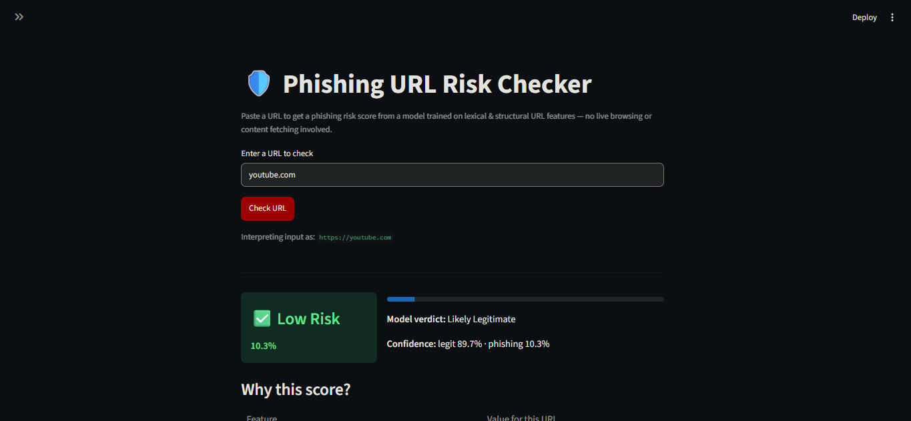
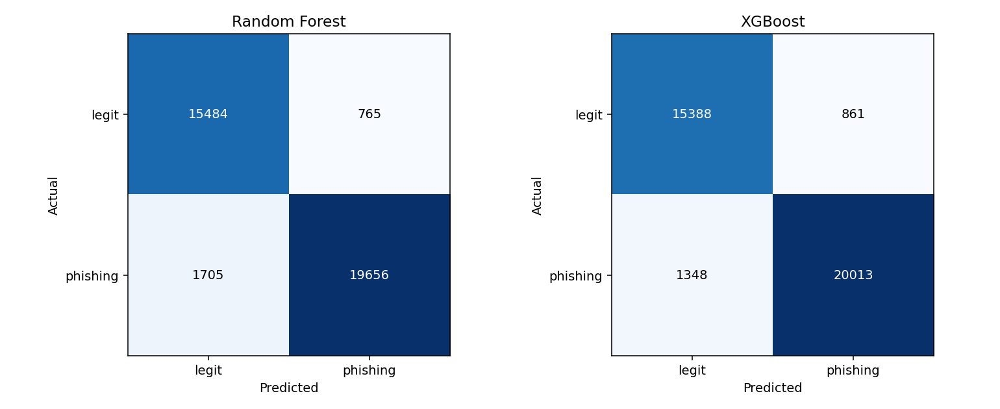
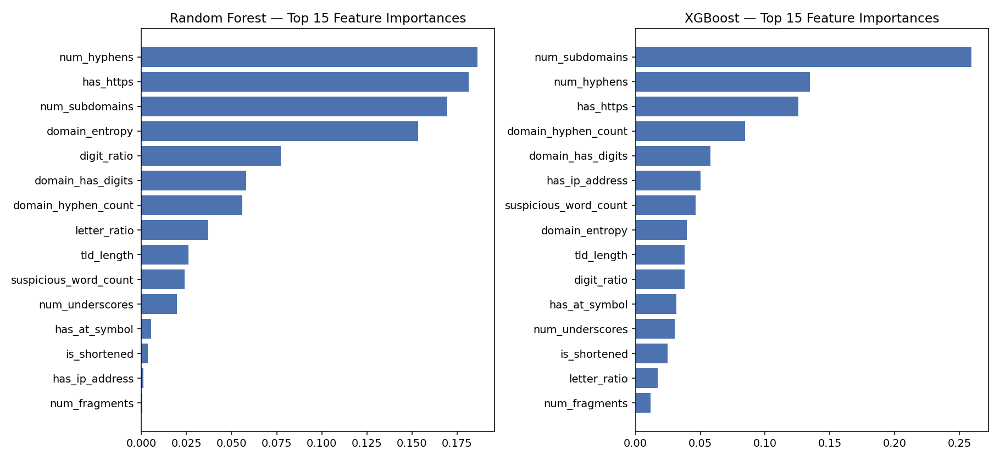

# 🛡️ AI-Assisted Phishing URL Classifier


A machine learning system that scores a URL's phishing risk from **lexical and
structural features only** — no live browsing, no content fetch — trained on
**~188K labeled URLs** and deployed as an interactive Streamlit app.

### 🔗 [**Live Demo →**](https://phishing-url-risk-checker-classifier-5hx3evqqga7jop6tgnvonr.streamlit.app)  ·  ⚡ Runs instantly & offline (no network calls)

> _Replace the link above with your Streamlit Community Cloud URL after deploying._

<p align="center">
  
  <br><em>Paste a URL → risk score, low/medium/high verdict, and the features driving it.</em>
</p>

> _Add `reports/app_screenshot.png` (a screenshot or GIF of the running app) to complete the banner above._

---

## ⭐ Highlight: catching & fixing two real rounds of data leakage

The part of this project I'm proudest of isn't the accuracy — it's the debugging
judgment behind it. A first pass hit a suspicious **99.5%+ accuracy**. Instead of
shipping that number, I dug in and found — and fixed — **two separate leakage bugs**.

**Round 1 — "has a path → phishing".** My initial legitimate URLs (from PhiUSIIL)
were bare homepages (`https://example.com`, no path), while phishing URLs almost
always had paths. The model learned the dataset artifact, not phishing. **Fix:**
added the UNB benign corpus (35K legit URLs *with* real paths) and rebalanced
path-presence across classes.

**Round 2 — source-confounded magnitude features.** Even after that, the model
flagged ordinary links like `github.com/anthropics` as phishing with near-100%
confidence. Raw length features (`url_length`, `path_length`, `domain_length`,
`num_slashes`) turned out to encode *which source dataset* a URL came from — my
legit corpus happened to have longer paths than my phishing corpus, the opposite
of intuition. **Fix:** dropped 9 raw-magnitude features in favor of
scale-invariant ratios and bounded counts, generated 30K realistic synthetic
legit deep links across 140+ well-known domains, and regularized both models.

**Result:** accuracy dropped from an inflated 99.5%+ to an honest **~94%** — and
the model now correctly handles **15 of 17** hand-picked real-world sanity URLs it
had never seen (GitHub, Amazon, Reddit, LinkedIn deep links) while still catching
every phishing example with high confidence.

---

## 📊 Model comparison

Evaluated on a stratified 20% held-out test set (37,610 URLs). Full metrics in
[`reports/model_comparison.json`](reports/model_comparison.json).

| Model | Accuracy | Precision | Recall | F1 | ROC-AUC | False-Positive Rate | Train time |
|-------|:--------:|:---------:|:------:|:-----:|:-------:|:-------------------:|:----------:|
| **XGBoost** ⭐ | **94.1%** | 95.9% | **93.7%** | **0.948** | **0.982** | 5.3% | **2.9 s** |
| Random Forest | 93.4% | **96.3%** | 92.0% | 0.941 | 0.980 | **4.7%** | 24.2 s |

XGBoost is the default in the app (best F1/recall and ~8× faster to train);
Random Forest edges it on precision/false-positive rate. Both are reported
honestly — **precision, recall, F1, ROC-AUC and false-positive rate, not just
accuracy** — because in a security context a false negative and a false positive
cost very different things.

<p align="center">
  
  
</p>

---

## 🧭 Pipeline

1. **Data** — Combined multiple public sources (PhiUSIIL, UNB benign corpus,
   PhishTank-derived and manually-verified phishing lists) into ~188K labeled
   URLs, plus 30K synthetically generated realistic legit deep links across 140+
   well-known domains (`src/augment_data.py`).
2. **Feature engineering** (`src/features.py`) — 27 features extracted directly
   from the raw URL string; **18 survive leakage filtering** and feed the model:
   HTTPS usage, subdomain count, hyphen/digit/special-char counts and ratios,
   domain character entropy, IP-as-domain detection, known-shortener detection,
   suspicious-keyword count, and more. **This single file is shared verbatim
   between training and the app** (see architecture note below).
3. **Modeling** (`src/train.py`) — Random Forest and XGBoost, compared on six
   metrics. Regularized (shallow trees, min leaf size, L1/L2 penalties) after an
   early version overfit.
4. **App** (`app/app.py`) — Streamlit interface: paste a URL, get a risk score,
   a low/medium/high verdict, the top features driving it, and every extracted
   feature on demand.

---

## 🔒 Engineering notes

- **No train/serve drift by construction.** Feature logic lives in exactly one
  file, `src/features.py`, imported by both the training pipeline and the app —
  there is no duplicated copy to fall out of sync.
- **Strict feature-order integrity.** The trained feature order is persisted to
  `models/feature_columns.json` and the app reindexes every request to match it
  by name, so column order can never silently diverge from training.
- **Robust input handling.** Malformed, scheme-less, IP-based, encoded, and
  even unparseable URLs (e.g. broken IPv6 literals) are handled without ever
  surfacing a raw traceback to the user.
- **Offline & deterministic.** No WHOIS/DNS/live requests — every feature is a
  pure function of the URL string, so results are instant and reproducible.

---

## ⚠️ Known limitations

- **Lexical-only.** The model never sees page content, so a well-crafted
  phishing URL that mimics normal structure (or a legit URL with unusual
  structure) can fool it either way. Treat the score as one signal, not a verdict.
- **Dataset drift.** Public phishing datasets skew toward a particular era of
  phishing kit; performance on brand-new campaigns will likely be lower than the
  held-out score.
- **Not a production tool.** No rate limiting, live blocklist, or monitoring.
  Built for learning and portfolio purposes.

---

## 🗂️ Project structure

```
phishing_url_classifier/
├── data/                    # raw + processed datasets
├── src/
│   ├── features.py          # ← canonical feature extraction (shared by training + app)
│   ├── augment_data.py      # synthetic legit-URL generator
│   └── train.py             # training + evaluation + plots
├── models/                  # trained artifacts + feature_columns.json
├── reports/                 # confusion matrices, feature importance, metrics json
├── app/
│   └── app.py               # Streamlit app (imports src/features.py — no copy)
├── retrain_local.py         # one-command model regeneration
└── requirements.txt
```

---

## 🚀 Running the app

```bash
pip install -r requirements.txt
streamlit run app/app.py
```

To regenerate the model artifacts from scratch (under a minute on a laptop):

```bash
python retrain_local.py
```

---

## 🔭 Possible extensions

- Per-prediction explanations with SHAP (`TreeExplainer`) instead of global importances
- Fine-tune a small transformer (DistilBERT) directly on raw URL text
- Browser-extension wrapper
- Live PhishTank feed for continuously updated training data

---

## 📝 License

MIT — see [`LICENSE`](LICENSE).
